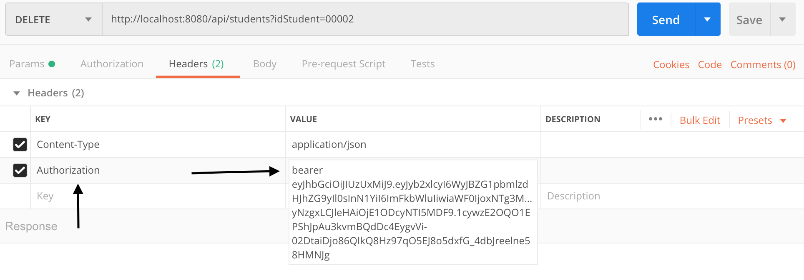
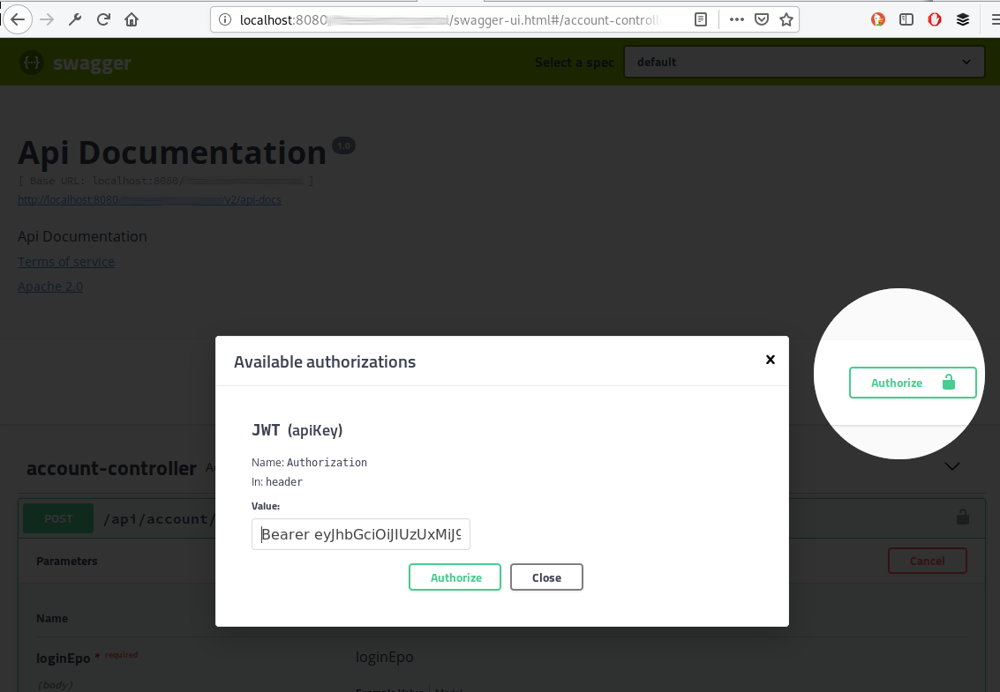

# spring-reactive

# EndPoints
| Login Controller | Path |
| ------ | ------ |
| Login ```POST``` | ```/login``` |
| Login V2 ```POST```| ```/v2/login``` |

> Los siguientes endPoints requiren un token JWT para ser consumidos

# Annotation EndPoints
| Controller Estudiantes | Path |
| ------ | ------ |
| Listar ```GET``` | ```/api/estudiantes``` |
| Listar por ID ```GET```| ```/api/estudiantes/{idEstudiante}``` |
| Registrar ```POST``` | ```/api/estudiantes``` |
| Modificar ```PUT``` | ```/api/estudiantes``` |
| Eliminar ```DELETE``` | ```/api/estudiantes/{idEstudiante}``` |
| Listar Paralelo ```GET``` | ```/api/estudiantes/sortedByAgeParallel``` |

| Controller Cursos | Path |
| ------ | ------ |
| Listar ```GET``` | ```/api/cursos``` |
| Listar por ID ```GET```| ```/api/cursos/{idCurso}``` |
| Listar por ID's ```GET```| ```/api/cursos/listarPorIds``` |
| Registrar ```POST``` | ```/api/cursos``` |
| Modificar ```PUT``` | ```/api/cursos``` |
| Eliminar ```DELETE``` | ```/api/cursos/{idCurso}``` |

| Controller Matricula | Path |
| ------ | ------ |
| Registrar ```POST``` | ```/api/matriculas``` |

# Functional EndPoints
| Controller Estudiantes | Path |
| ------ | ------ |
| Listar ```GET``` | ```/estudiantes``` |
| Listar por ID ```GET```| ```/estudiantes/{dni}``` |
| Registrar ```POST``` | ```/estudiantes``` |
| Modificar ```PUT``` | ```/estudiantes``` |
| Eliminar ```DELETE``` | ```/estudiantes/{dni}``` |
| Listar Paralelo ```GET``` | ```/estudiantesParallel``` |

| Controller Cursos | Path |
| ------ | ------ |
| Listar ```GET``` | ```/cursos``` |
| Listar por ID ```GET```| ```/cursos/{id}``` |
| Registrar ```POST``` | ```/cursos``` |
| Modificar ```PUT``` | ```/cursos``` |
| Eliminar ```DELETE``` | ```/{id}``` |

| Controller Matricula | Path |
| ------ | ------ |
| Registrar ```POST``` | ```/matriculas``` |

### Run the APP

La Aplicacion va a iniciar por el puerto 8080, asi que se puede acceder a Swagger por la siguiente URL
http://localhost:8080/swagger-ui.html

> Los EndPoint que requieren un token de JWT se pueden consumir de la siguiente forma:

##### POSTMAN

##### SWAGGER


##### Configuration
Por defecto la duracion del token JWT es de 120seg
```yaml
jjwt:
  secret: 4u7x!A%D*G-KaNdRgUkXp2s5v8y/B?E(H+MbQeShVmYq3t6w9z$C&F)J@NcRfUjW
  expiration: 120
```
El usuario y el pass para consumir los endpoints del login y obtener un token esta configurado con los siguientes valores.
```yaml
springreactive:
  username: admin
  pass: root
```

La configuracion de la base de datos de mongo puede ser editada en las siguientes propiedades
```yaml
spring:
  data:
    mongodb:
      authentication-database: admin
      host: localhost
      username: root
      password: password
      port: 27017
      database: academiaapp
```